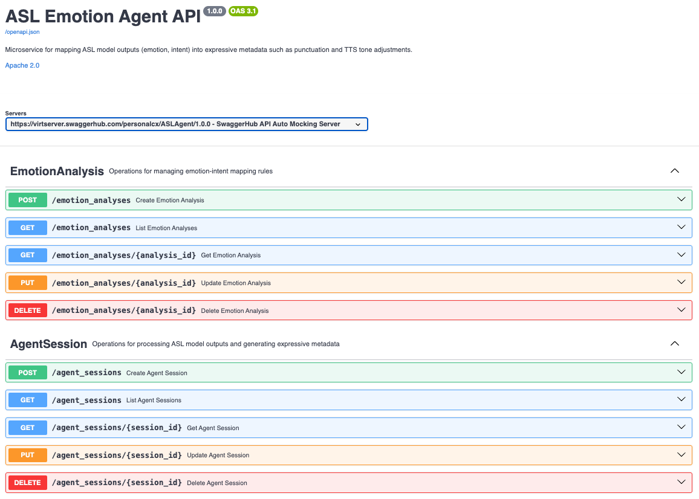

# Emotion Agent Microservice

A FastAPI microservice for the ASL Translation system that interprets **emotion** and **intent** from model outputs, mapping them into expressive metadata — such as punctuation and text-to-speech (TTS) tone — to make generated speech more natural.

---

## Overview
**Resources & APIs:**
- **`ExpressionRule`** – Configuration rules mapping (emotion, intent) → punctuation/TTS adjustments.  
- **`TranslationSession`** – Runtime records of processed inputs, compose/analyze/TTS metadata, user word preferences, and optional session summaries.  
- **`ComposeSentence`** – Real-time endpoint that calls OpenAI to turn gloss/word lists into fluent English sentences.

---

## API Reference
- This project follows an API-first workflow defined in Swagger.
- View the latest Swagger contract on SwaggerHub: [ASL Emotion Agent API](https://app.swaggerhub.com/apis/personalcx/ASLAgent/1.0.0)
- Resolved contract included in the repo: `swagger_api.json`
- Quick preview of the documented endpoints:

[](https://app.swaggerhub.com/apis/personalcx/ASLAgent/1.0.0)

---


## 🗄️ Database Schema 

This database stores the configuration rules and runtime outputs managed by the Emotion Agent service, including compose/analyze/TTS/summarize artifacts directly inside the `translation_sessions` table.

---

### `translation_sessions`

Captures each processed ASL model output and the metadata generated for playback.

| Column Name | Type | Description |
|-------------|------|-------------|
| **id** | `CHAR(36)` | Primary key — UUID for each session |
| **user_id** | `VARCHAR(64)` | Optional user identifier for personalization |
| **glosses** | `JSON` | Ordered list of glosses passed to `compose_sentence` |
| **letters** | `JSON` | Optional detected fingerspelling letters |
| **preferred_words** | `JSON` | Gloss → preferred word overrides set by the user |
| **context** | `TEXT` | Dialog context forwarded to `compose_sentence` |
| **input_text** | `TEXT` | Raw text produced by the ASL model |
| **compose_confidence** | `FLOAT` | Confidence returned by `compose_sentence` |
| **compose_alternatives** | `JSON` | Alternate English renderings |
| **detected_emotion** | `VARCHAR(50)` | Emotion inferred from `analyze_clip` |
| **detected_intent** | `VARCHAR(50)` | Intent inferred from `analyze_clip` |
| **emphasis** | `JSON` | Highlighted tokens from `analyze_clip` |
| **adjusted_text** | `TEXT` | Text after punctuation/tone rules |
| **tts_metadata** | `JSON` | Voice, tone, audio URL, visemes, etc. sent to/returned from TTS |
| **tool_metadata** | `JSON` | Version identifiers for compose/analyze/TTS |
| **summary_text** | `TEXT` | Output of `summarize_session` (optional) |
| **summary_topics** | `JSON` | Topics extracted by the summarizer |
| **summary_action_items** | `JSON` | Action items extracted by the summarizer |
| **created_at** | `TIMESTAMP` | When the session was recorded |
| **updated_at** | `TIMESTAMP` | When it was last updated |

---
## 🧠 Using the API

Once the API is running, you can exercise the main flows:

### 1. Create a Translation Session
```bash
curl -X POST http://localhost:8080/translation_sessions \
  -H "Content-Type: application/json" \
  -d '{
        "glosses": [],
        "letters": [],
        "preferred_words": {},
        "context": "",
        "input_text": "",
        "compose_confidence": 0.0,
        "compose_alternatives": [],
        "detected_emotion": "neutral",
        "detected_intent": "statement",
        "emphasis": [],
        "adjusted_text": "",
        "tts_metadata": {},
        "tool_metadata": {},
        "summary_topics": [],
        "summary_action_items": []
      }'
```

### 2. Compose a Sentence for that Session
```bash
curl -X POST http://localhost:8080/translation_sessions/<session_id>/compose \
  -H "Content-Type: application/json" \
  -H "X-OpenAI-Key: sk-your-key" \
  -d '{
        "glosses": ["IX-1","GOOD","IDEA"],
        "letters": ["A","I"],
        "openai_model": "gpt-4o-mini"
      }'
```
The response includes the updated session with the composed sentence, appended context, and confidence.

### 3. (Optional) Hit the raw Compose endpoint
Send a list of glosses/words to `/compose/sentence` and the service calls OpenAI to produce a fluent sentence.

```bash
curl -X POST http://localhost:8080/compose/sentence \
  -H "Content-Type: application/json" \
  -H "X-OpenAI-Key: sk-your-key" \
  -d '{
        "glosses": ["IX-1","GOOD","IDEA"],
        "letters": ["A","I"],
        "context": "Planning next sprint tasks",
        "openai_model": "gpt-4o-mini"
      }'
```

Response:

```json
{
  "text": "That's a good idea for our next sprint.",
  "confidence": null,
  "model": "gpt-4o-mini"
}
```

Remember: the API now accepts client-supplied OpenAI credentials. Pass `openai_api_key` / `openai_model` in the JSON body or `X-OpenAI-Key` / `X-OpenAI-Model` headers. If neither is provided, the server will fall back to `OPENAI_API_KEY` env vars (if configured).

---

## 🚀 Run the ASL Emotion Agent

This service can be executed in three ways:

1. **Local Run (Conda + Python)** — easiest for development  
2. **Local Run via Docker** — containerized version of the service  
3. **Cloud Deployment (Docker Hub + Cloud Run)** — production deployment

---

## 🧩 1. Local Run (Conda + Python)

```bash
git clone https://github.com/char15xu/aslagent.git
cd aslagent

# Create and activate environment
conda create -n aslagent-env python=3.11 -y
conda activate aslagent-env

# Install dependencies
pip install -r requirements.txt

# Start the API
python -m app.main
```

Visit **http://localhost:8080/docs** for the interactive Swagger UI.

---

## 🐳 2. Local Run (Docker)

This runs the service locally, but inside a Docker container.

### Install Docker  
Download: https://www.docker.com/products/docker-desktop/

### Build the image

```bash
docker build -t aslagent .
```

### Run the container

```bash
docker run -p 8080:8080 \
  -e DB_HOST=127.0.0.1 \
  -e DB_PORT=3306 \
  -e DB_USER=asl_agent \
  -e DB_PASSWORD=super-secret \
  -e DB_NAME=asl_agent \
  aslagent
```
If you’ve already created a `.env`, you can load it directly instead of passing each flag:
```bash
docker run -p 8080:8080 --env-file .env aslagent
```

Open:  
http://localhost:8080/docs

---
